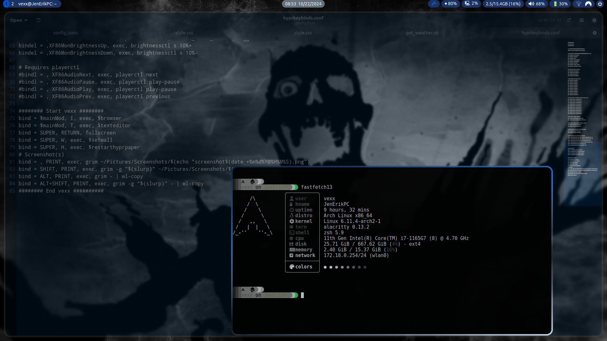
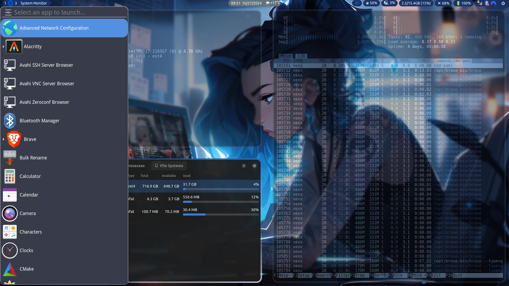

<b>My Hyprland dotfiles.</b> 
For Arch... btw. 
A constant work in progress 

Very basic, most code or configs have been stolen from other people or chatgpt. 
I are not a programmer at all, I only made this public as a warning of what not to do, lol.
the .zshrc was largely just a kali clone.

 

Requires: 
 
fastfetch 
wal 	- for color changing w/ wallpaper script 
mako 	- notifications 
hyprpaper 
waybar 
...Hyprland

Currently no install file, just move - 
.config 
.zshrc 
- to your home directory (You should backup your stuff)

In conclusion... Don't download this, you'll only be disapointed.

Notable keybinds:

Win+W		= Set wallpaper and change some colors with wal 
Win+H		= Restart OR start hyprpaper 
Win+Alt+H	= Restart OR start waybar 
Win+C		= Terminal 
Win+Q		= Kill active window 
